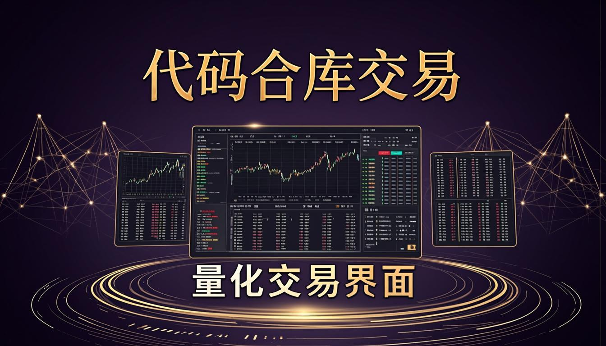
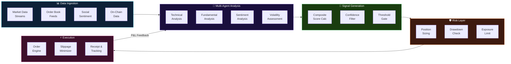
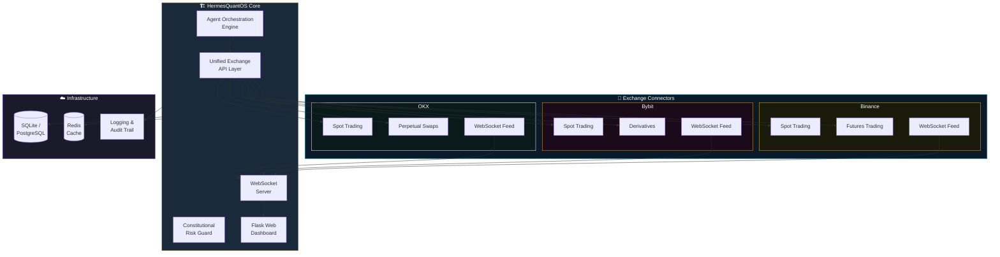

<a href="https://github.com/mulkymalikuldhrs/HermesQuantOS">
  
</a>

<div align="center">

[](https://git.io/typing-svg)

<br/>

[](https://github.com/mulkymalikuldhrs/HermesQuantOS)
[](https://github.com/mulkymalikuldhrs/HermesQuantOS)
[](https://github.com/mulkymalikuldhrs/HermesQuantOS)
[](https://github.com/mulkymalikuldhrs/HermesQuantOS)
[](https://github.com/mulkymalikuldhrs/HermesQuantOS/releases)
[](LICENSE)

<br/>

[](https://github.com/mulkymalikuldhrs/HermesQuantOS/stargazers)
[](https://github.com/mulkymalikuldhrs/HermesQuantOS/fork)
[](https://github.com/mulkymalikuldhrs/HermesQuantOS/issues)

</div>

---

## Overview

HermesQuantOS is an **autonomous multi-agent trading infrastructure** featuring 21 specialized AI agents coordinated through a Constitutional Risk Guard. Built with Python and Flask, it delivers a real-time web dashboard for monitoring agent activity, risk assessment, portfolio management, and multi-exchange execution from a single interface.

The system implements a layered architecture where specialized agents handle distinct trading responsibilities — market analysis, signal generation, risk assessment, execution management, and portfolio optimization — all supervised by an independent safety layer that enforces hard-coded risk rules **immune to AI override**.

> **Transparency First**: This is **experimental software**. The AI agents provide analysis and configurable strategy signals — **not guaranteed profit signals**. All trading involves significant risk of loss. The Constitutional Risk Guard reduces but **cannot eliminate** risk. **Always test with paper trading before committing real capital.** Multi-exchange support depends on API availability and rate limits.

---

## Features

### Agent System

- **21 Specialized AI Agents** — Each agent handles a distinct domain: market microstructure analysis, momentum detection, mean-reversion signals, sentiment scoring, volatility modeling, liquidity assessment, execution optimization, portfolio rebalancing, and more
- **Constitutional Risk Guard** — An independent safety layer with hard-coded risk rules (max drawdown, position sizing, exposure limits) that **cannot be overridden** by any AI agent, ensuring fail-safe boundaries at all times
- **Agent Orchestration Engine** — Coordinates inter-agent communication, task delegation, and conflict resolution across the full agent swarm

### Trading and Execution

- **Multi-Exchange Support** — Unified API layer connecting to Binance, Bybit, OKX, and other exchanges (subject to API availability and regional access)
- **Configurable Strategy Engine** — Define, backtest, and deploy custom trading strategies with parameterized entry/exit logic and risk overlays
- **Smart Order Execution** — Intelligent order routing with slippage minimization, split execution, and adaptive limit/market order selection

### Monitoring and Safety

- **Real-time Web Dashboard** — Flask-based interface with WebSocket-powered live updates for agent status, open positions, P&L tracking, and risk metrics
- **Paper Trading Mode** — Full-featured simulated trading environment to validate strategies and agent behavior before committing real capital
- **Alert and Notification System** — Configurable alerts for risk threshold breaches, trade executions, agent state changes, and system events

---

## Architecture

```
┌─────────────────────────────────────────────────────────────────────┐
│                        HermesQuantOS Architecture                   │
├─────────────────────────────────────────────────────────────────────┤
│                                                                     │
│  ┌─────────────────────┐    ┌─────────────────────┐                │
│  │   Flask Web Dashboard│◄──►│  WebSocket Server    │                │
│  │   (Monitoring / UI)  │    │  (Real-time Feeds)   │                │
│  └──────────┬───────────┘    └──────────┬───────────┘                │
│             │                           │                            │
│             ▼                           ▼                            │
│  ┌─────────────────────────────────────────────────────┐            │
│  │              Agent Orchestration Engine               │            │
│  │     (Task delegation • Conflict resolution • Routing)│            │
│  └──────────────────────┬──────────────────────────────┘            │
│                         │                                           │
│         ┌───────────────┼───────────────┐                           │
│         ▼               ▼               ▼                           │
│  ┌─────────────┐ ┌─────────────┐ ┌─────────────┐                   │
│  │  Analysis    │ │  Signal      │ │  Execution   │                  │
│  │  Agents (7)  │ │  Agents (7)  │ │  Agents (7)  │                  │
│  │              │ │              │ │              │                   │
│  │ • Microstructure│ • Momentum │ │ • Smart Order│                  │
│  │ • Sentiment  │ │ • Mean-Revert│ │ • Split Exec │                  │
│  │ • Volatility │ │ • Breakout  │ │ • Routing    │                  │
│  │ • Liquidity  │ │ • Scalping   │ │ • Portfolio  │                  │
│  │ • On-chain   │ │ • Swing     │ │ • Rebalancer │                  │
│  │ • Correlation│ │ • Arbitrage │ │ • Hedger     │                  │
│  │ • Macro      │ │ • Contrarian│ │ • Stop Mgmt  │                  │
│  └──────┬───────┘ └──────┬───────┘ └──────┬───────┘                  │
│         │                │                │                           │
│         └────────────────┼────────────────┘                           │
│                          ▼                                           │
│  ┌─────────────────────────────────────────────────────┐            │
│  │           ⚠️  Constitutional Risk Guard  ⚠️          │            │
│  │                                                      │            │
│  │  • Max Drawdown Enforcement    • Position Size Limits │           │
│  │  • Exposure Cap Enforcement    • Kill Switch Protocol │           │
│  │  • Leverage Hard Limits        • Circuit Breakers     │           │
│  │                                                      │            │
│  │         🔒 Rules are IMMUNE to AI override 🔒         │            │
│  └──────────────────────┬──────────────────────────────┘            │
│                         │                                           │
│                         ▼                                           │
│  ┌─────────────────────────────────────────────────────┐            │
│  │              Unified Exchange API Layer               │            │
│  │                                                      │            │
│  │   ┌─────────┐  ┌─────────┐  ┌─────────┐            │            │
│  │   │ Binance  │  │  Bybit   │  │   OKX   │  ...       │            │
│  │   └─────────┘  └─────────┘  └─────────┘            │            │
│  └─────────────────────────────────────────────────────┘            │
│                                                                     │
└─────────────────────────────────────────────────────────────────────┘
```

---

## Visual Architecture

> Interactive diagrams showing system design, data flow, and implementation status. Click any diagram to expand.

### 3-Tier Agent Swarm Architecture

```mermaid
graph TB
    subgraph TIER1["🔍 TIER 1 — ANALYSIS AGENTS"]
        A1["Microstructure<br/>Analyzer"]
        A2["Sentiment<br/>Scanner"]
        A3["Volatility<br/>Modeler"]
        A4["Liquidity<br/>Assessor"]
        A5["On-Chain<br/>Analyst"]
        A6["Correlation<br/>Engine"]
        A7["Macro<br/>Analyst"]
    end

    subgraph TIER2["📡 TIER 2 — SIGNAL AGENTS"]
        S1["Momentum<br/>Detector"]
        S2["Mean-Reversion<br/>Signal"]
        S3["Breakout<br/>Identifier"]
        S4["Scalping<br/>Signal"]
        S5["Swing Trade<br/>Signal"]
        S6["Arbitrage<br/>Detector"]
        S7["Contrarian<br/>Signal"]
    end

    subgraph TIER3["⚡ TIER 3 — EXECUTION AGENTS"]
        E1["Smart Order<br/>Router"]
        E2["Split<br/>Executor"]
        E3["Order<br/>Router"]
        E4["Portfolio<br/>Rebalancer"]
        E5["Hedging<br/>Agent"]
        E6["Stop Loss<br/>Manager"]
        E7["Position<br/>Sizer"]
    end

    subgraph GUARD["🔒 CONSTITUTIONAL RISK GUARD"]
        RG["⚠️ Risk Gate"]
        RG --> DD["Max Drawdown<br/>Enforcement"]
        RG --> PS["Position Size<br/>Limits"]
        RG --> EC["Exposure Cap<br/>Enforcement"]
        RG --> KS["Kill Switch<br/>Protocol"]
        RG --> CB["Circuit<br/>Breakers"]
        RG --> LV["Leverage<br/>Hard Limits"]
    end

    TIER1 -->|"Raw Analysis<br/>Feed"| TIER2
    TIER2 -->|"Composite<br/>Signals"| TIER3
    TIER3 -->|"Execution<br/>Requests"| GUARD
    GUARD -->|"Approved<br/>Orders"| EXCHANGE["💱 Exchange<br/>Execution"]

    style TIER1 fill:#1a3a5c,stroke:#4a9eff,color:#fff
    style TIER2 fill:#1a4a3c,stroke:#4aff9e,color:#fff
    style TIER3 fill:#3a2a1c,stroke:#ff9e4a,color:#fff
    style GUARD fill:#3a1a1a,stroke:#ff4a4a,color:#fff
    style EXCHANGE fill:#2a1a3a,stroke:#b44aff,color:#fff
```



### Trading Pipeline — Signal to Execution



### Multi-Exchange Architecture



### Honest Implementation Status Map


> **Legend**: 🟢 Green = Implemented | 🟡 Yellow = Partially Built | 🔴 Red = Planned/Conceptual
>
> The 21-agent architecture represents our **design vision**. Most agents exist as architectural concepts rather than working implementations. This is an active scaffold — contributions welcome.

---

## Honest Notes

> We believe in radical transparency. Here are the hard truths about this project.

| Topic | Reality |
|---|---|
| **Profitability** | Experimental software — **no guarantee of profitable trading outcomes** |
| **AI Signals** | Agents provide analysis based on configurable strategies — **not guaranteed profit signals** |
| **Risk Guard** | Constitutional Risk Guard **reduces** but **cannot eliminate** trading risk |
| **Testing** | **Always** validate with paper trading before using real funds |
| **Exchange Support** | Multi-exchange connectivity **depends on API availability**, regional access, and rate limits |
| **Market Conditions** | No strategy performs well in all market conditions — past backtests ≠ future results |

---

## Quick Start

### Prerequisites

- Python 3.10+
- Exchange API credentials (use **testnet** keys first)

### Installation

```bash
# Clone the repository
git clone https://github.com/mulkymalikuldhrs/HermesQuantOS.git
cd HermesQuantOS

# Install dependencies
pip install -r requirements.txt

# Configure environment
cp .env.example .env
# Edit .env — set exchange API keys (USE TESTNET FIRST)

# Launch the platform
python app.py
```

### First Steps

1. **Start in Paper Trading Mode** — Validate agent behavior with simulated orders
2. **Monitor the Dashboard** — Watch agent activity, signals, and risk metrics at `http://localhost:5000`
3. **Configure Strategies** — Customize agent parameters and strategy overlays
4. **Review Risk Guard Settings** — Adjust Constitutional Risk Guard thresholds to your risk tolerance
5. **Only Then Consider Live Trading** — After extensive paper trading validation

---

## Contributing

Contributions are welcome! Please follow these steps:

1. **Fork** the repository
2. Create a **feature branch** (`git checkout -b feature/amazing-feature`)
3. **Commit** your changes (`git commit -m 'Add amazing feature'`)
4. **Push** to the branch (`git push origin feature/amazing-feature`)
5. Open a **Pull Request**

Please ensure your contributions align with the project's transparency-first philosophy — no misleading claims about profitability or risk elimination.

---

## Disclaimer

**For Education and Research Purpose Only**

This project is provided strictly for educational and research purposes. The authors and contributors assume **no responsibility or liability** for any financial damages, losses, or risks arising from the use of this software. **We do not bear any responsibility or risk** for how this software is used.

**Trading cryptocurrencies and other financial instruments involves substantial risk of loss.** You should carefully consider whether trading is appropriate for you in light of your financial condition. Past performance is not indicative of future results. The AI agents in this system provide analysis and signals — they do not guarantee profits and can produce incorrect or unprofitable signals.

---

## License

This project is licensed under the **MIT License** — see the [LICENSE](LICENSE) file for details.

Copyright © 2024-2026 Mulky Malikul Dhaher. All rights reserved.

---

## Author

**Mulky Malikul Dhaher**

[](https://github.com/mulkymalikuldhrs)
[](mailto:mulkymalikudhr@mail.com)

---

<a href="https://github.com/mulkymalikuldhrs/HermesQuantOS">
  
</a>
